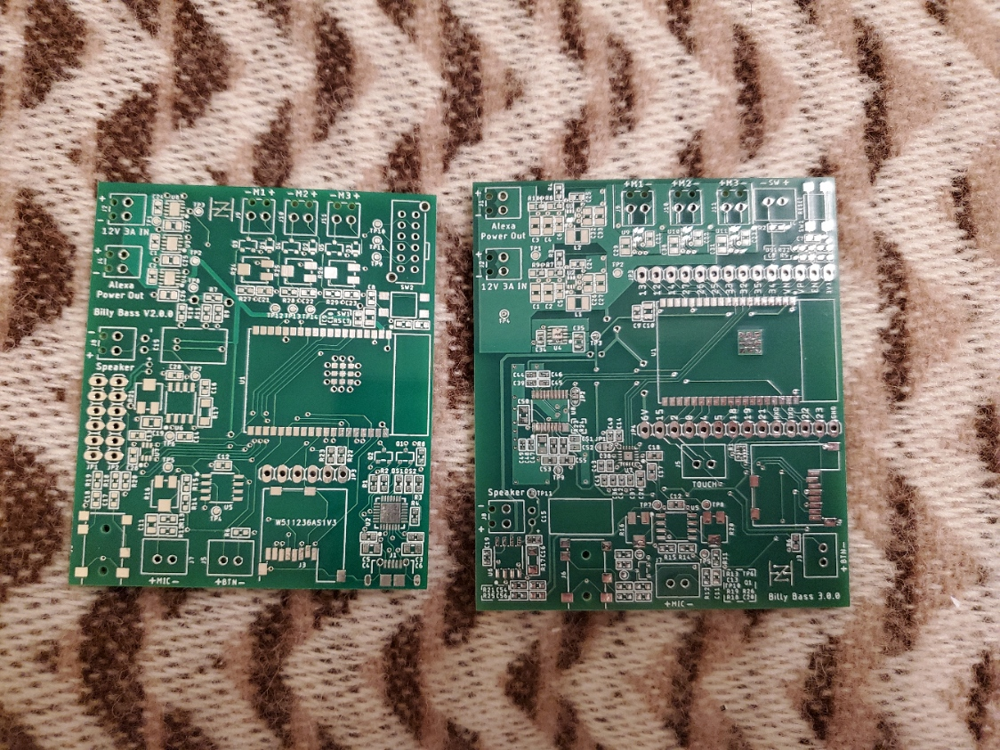
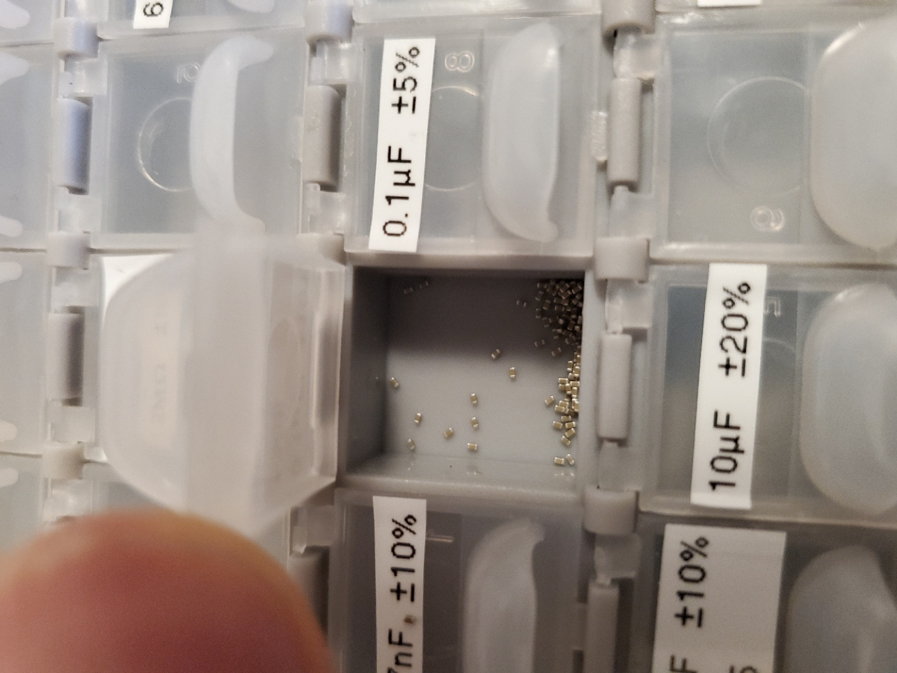
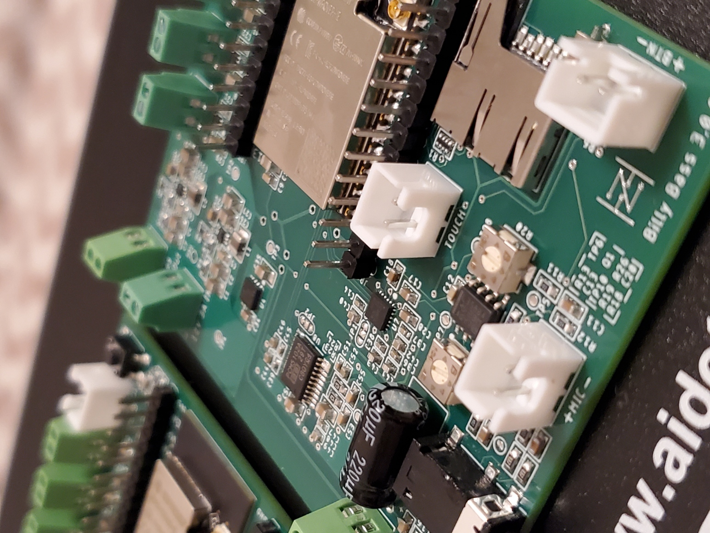

# Billy Bass Board 

Over the course of this project, I have developed more and more sophisticated ways to 'hack' a Big Mouth Billy Bass into an IoT device. A few others have successfully done this to a reasonable degree, however I continue to use this as an educational challenge and hope to address some of the shortcomings I've seen in other attempts. These include inaccurate motor timing and building a standalone device capable of voice regonition without internet access.

## Latest Version: v3.0.0

This latest version attempts to transition away from the Amazon Echo Dot into a completely stand-alone device. This includes adding an on-board I2S ADC and DAC, transitioning to H-bridge motor drivers, and addressing the shortcoming of version two. 

Note that while the board is complete, I am still completing programming and attempting to migrate version two's code from Arduino into the ESP_IDF framework.

## Features

The following sections explain the components and features of the lastest board, including their uses, my reasoning for including them, and how they contribute to the standalone capability of the device.

### ESP32-Wrover

This microprocessor has been my key to transitioning from the Amazon Echo Dot to a standalone device. With a built-in Bluetooth and Wi-Fi antenna, I can now connect directly to the microprocessor from my phone and from the microprocessor to the internet. Additionally, the ESP32 can interface with the Arduino ecosystem and libraries, including sophisiticated ones like pschatzmann's Audio Tools.

### I2S ADC and DAC

In the quest for better reliability and sound quality, I found the newly added I2S ADC and DAC. These enable me to quickly and accuratly stream sound in and out without compromizing signal integrity. Furthermore, audio can now be fully controlled and converted on-board, adding the final piece of the standalone device.

### H-Bridge Motor Drivers

H-bridge motor driver ICs have been added to reduce size, increase efficiency, and boost the control over each motor. Now, forward and backward movement can be controlled through software and fully coupled to the audio signals. 

### Connectors

New:
- Touch Sensors - For volume control, removing a dependancy on the Echo Dot
- External Switch - For hardware toggling of motor movements

Still Supported:
- Speaker
- Aux Audio Jack
- Microphone
- Button
- SD Card
- 3 Motors
- 12V Out

## Image Gallery (v3.0.0)

Below are some renders and images of the latest version of the board and Billy.

Full 3D PCB render of v3.0.0

Comparison between the size and signal routing of v2.0.0 and v3.0.0

0402 (1005) sized capacitors, my thumb for reference. This was my first experience using components this small.

Close up of the I2S ADC in the rendered 3D PCB

Similar angle showing most of the soldered board

## Version History

The following is a reverse-chronological list of past versions. Note that the version numbers reference the hardware and PCB updates rather than the sofware changes.

- v3.0.0 (Fall 2023 - Spring 2024)
  - Added external I2S ADCs and DACs for more accurate readings and audio playback from the ESP32
  - Added a pre-amp to the aux audio input for larger amplitude, noise-free readings
  - Fixed grounding issues by transitioning to a single ground plane and controlling return currents
  - Added connectors for touch sensors and an external switch
  - Added a power indictor LED 
  - Removed the programming circuitry in favor of cost savings and utilizing the USB-UART boards
  - Transitioned from the I2C digipot to an audio mute circuit
  - Switched to H-bridge motor drivers for more control and flexability 

- v2.0.0 (Fall 2022 - Summer 2023)
  - Transitioned all the hardware and circuit designs to a PCB, including the audio amplifier, microprocessor, voltage reculators, and connectors
  - Added a programming circuit onto the PCB for a single point connection
  - Added connectors interfacing the PCB and Amazon Echo Dot
  - Developed crude unidirectional motor drivers with PWM controlled NPN transistors
  - Added an I2C digipot for volume control
  - Expanded upon the audio processing code
  - Added an SD card slot for custom audio files

- v1.0.0 (Summer 2022)
  - Initial attempt at converting the Big Mouth Billy Bass into an IoT device
  - Utilized an Arduino Uno with a motor driver shield for motor control
  - Deconstructed an Amazon Echo Dot and wired the output audio into the Arduino
  - Located a testpoint on the Amazon board that is pulled high when the wake word is detected
  - Created very crude code to move the mouth when audio was detected
  - Coded the head to move when the wake word was detected

## License

This project is still in the development stage with many flaws and much room for improvement. Should you be interested in using it, I would recommend reading the considerations below and adjusting the design to fit your needs.

## Project Considerations and Future Work

The following are considerations for others and ideas for what to change in future versions.
- The I2S SCLK, LRCLK, and motor driver pinheads simply act as antennas if soldered on and generate unnecessary noise
- Noise and interference is still being output by the speaker when no audio is output, consider other output capacitance options