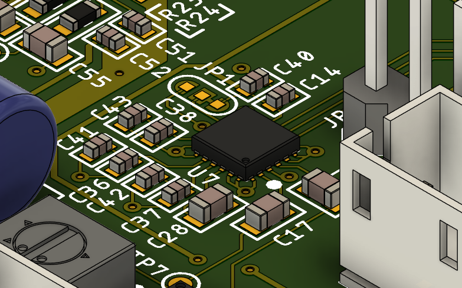

# Billy Bass Board 

Note: this README is still in progress.

Over the course of this project, I have developed more and more sophisticated ways to 'hack' a Big Mouth Billy Bass into an IoT device. A few others have successfully done this to a reasonable degree, however I continue to use this as an educational challenge and hope to address some of the shortcomings I've seen in other attempts, from inaccurate motor timing to building a standalone device capable of voice regonition without internet access.

## Latest Version: v3.0.0

This latest version attempts to transition away from the Amazon Echo Dot into a completely stand-alone device. This includes adding an on-board I2S ADC and DAC, transitioning to H-bridge motor drivers, and addressing the shortcoming of version two. The board is complete but I am still completing programming and am attempting to migrate version two's code from Arduino to the ESP_IDF framework in VS Code.

## Features

The following sections explain the components and features of the lastest board, including how they contribute to the standalone capability of the device and my reasoning for including them.

### ESP32-Wrover

My key to transitioning from the Amazon Echo Dot to a standalone device is the ESP32 microprocessor. With a built-in Bluetooth and Wi-Fi antenna, I can now connect directly to the microprocessor from my phone and/or from the microprocessor to the internet and thus many APIs. Including the use of sophisiticated libraries such as pschatzmann's Audio Tools, audio can be streamed over bluetooth to the board, converted and controlled, and sent to an external I2S DAC.

### I2S ADC and DAC

The newly added I2S ADC and DAC are the second reason I've been able to transition to a standalone device. Enabling me to quickly and accuratly stream mic and aux sound in, and output data to the speaker, audio can now be fully controlled and converted on-board.

### H-Bridge Motor Drivers

After testing different motor driver options on version two, H-bridge motor driver ICs have been added to reduce size, increase efficiency, and boost the control over each motor. Now, forward and backward movement can be controlled through software and thus by the audio. 

### Connectors

New:
- Touch Sensors - For volume control, removing a dependancy on the Echo Dot
- External Switch - For hardware toggling of motor movements
Still Supported:
- Speaker
- Aux Audio Jack
- Microphone
- Button
- SD Card
- 3 Motors

## Image Gallery (v3.0.0)

Below are some renders and images of the latest version of the board and Billy.

## Version History

The following is a reverse-chronological list of past versions. Note that the version numbers reference the hardware and PCB updates rather than the sofware changes.

- v3.0.0
  - Added external I2S ADCs and DACs for more accurate readings and audio playback from the ESP32
  - Used a single ground plane for ...............
  - Added power indictor LED 

- v2.0.0
  - built a board....
  - incorperated the audio amplifier...
  - Improvements

- v1.0.0
  - Initial attempt at converting the Big Mouth Billy Bass into an IoT device
  - Utilized an Arduino Uno with a motor driver shield for motor control
  - Deconstructed an Amazon Echo Dot and wired the output audio into the Arduino
  - Located a testpoint on the Amazon board that is pulled high when the wake word is detected
  - Created very crude code to move the mouth when audio was detected
  - Coded the head to move when the wake word was detected

## License

This project is still in the development stage with many flaws and much room for improvement. Should you be interested in using it, I would recommend reading the considerations below and adjusting the design to fit your needs.

## Project Considerations and Future Work

The following are considerations for others and ideas for what to change in future versions.
- The I2S SCLK, LRCLK, and motor driver pinheads simply act as antennas if soldered on and generate unnecessary noise.
- more to come...