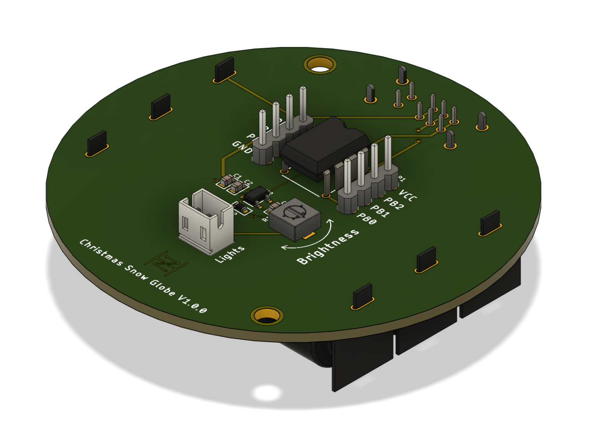
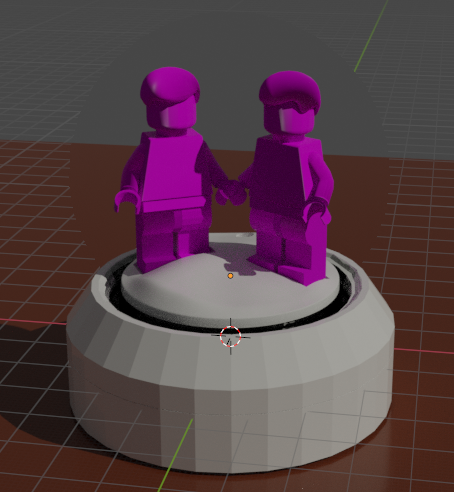
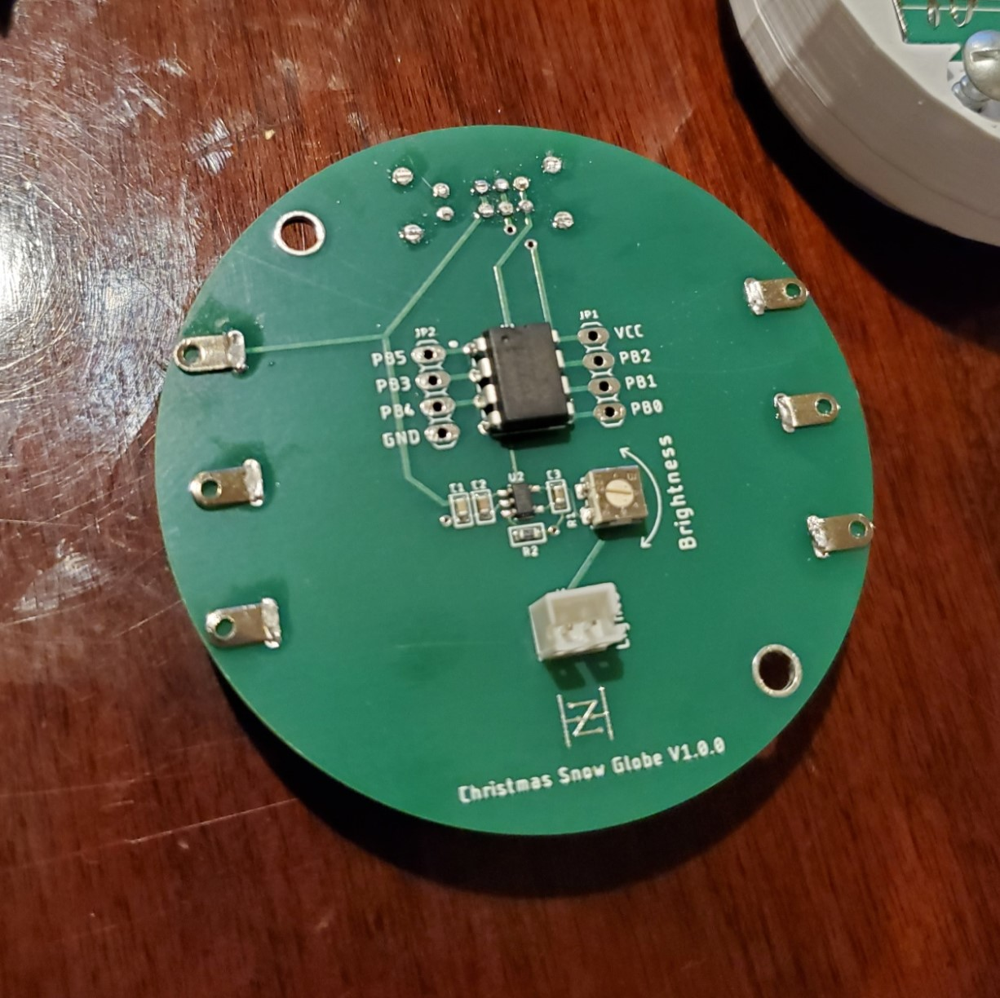
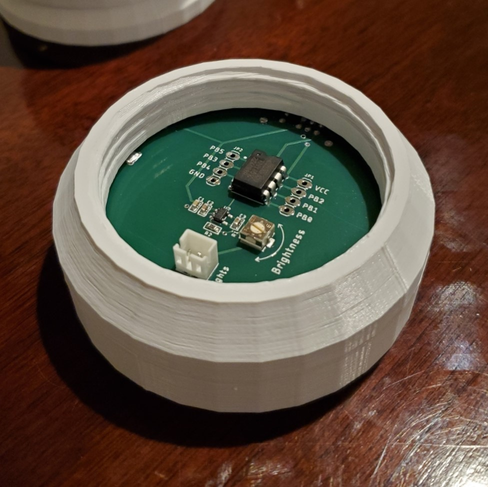
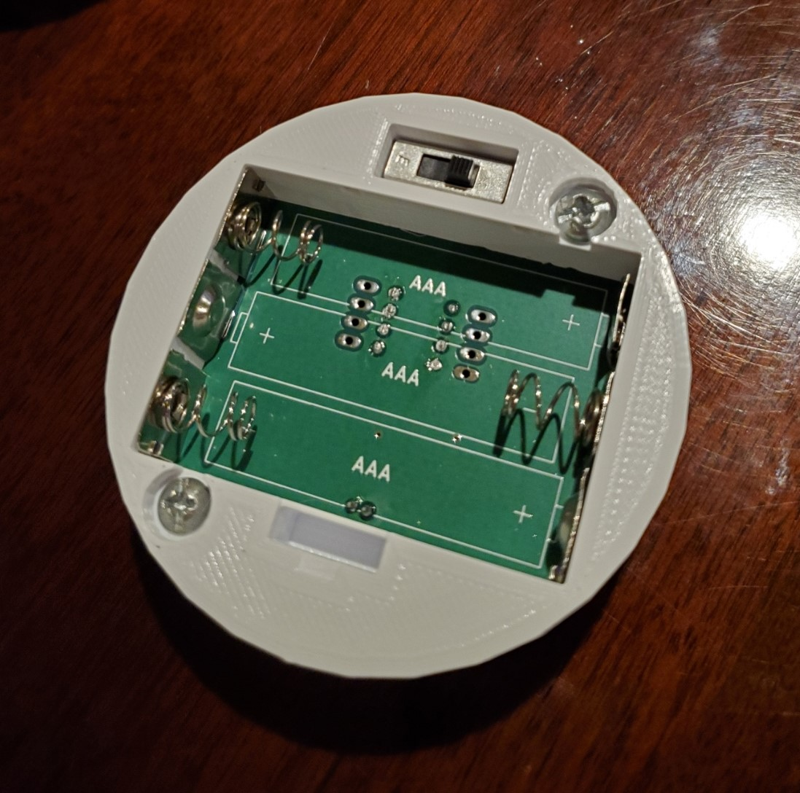
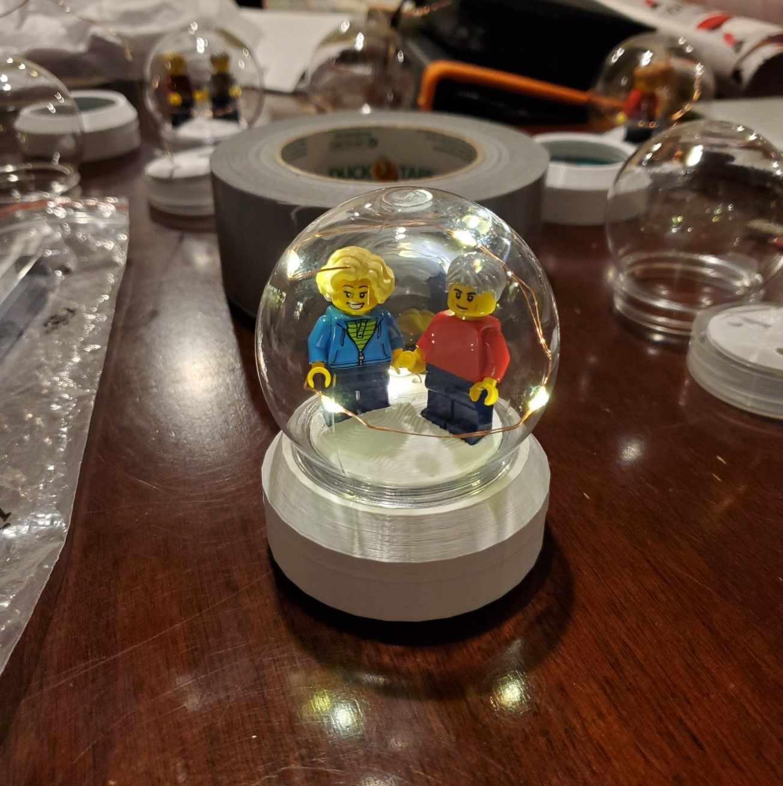
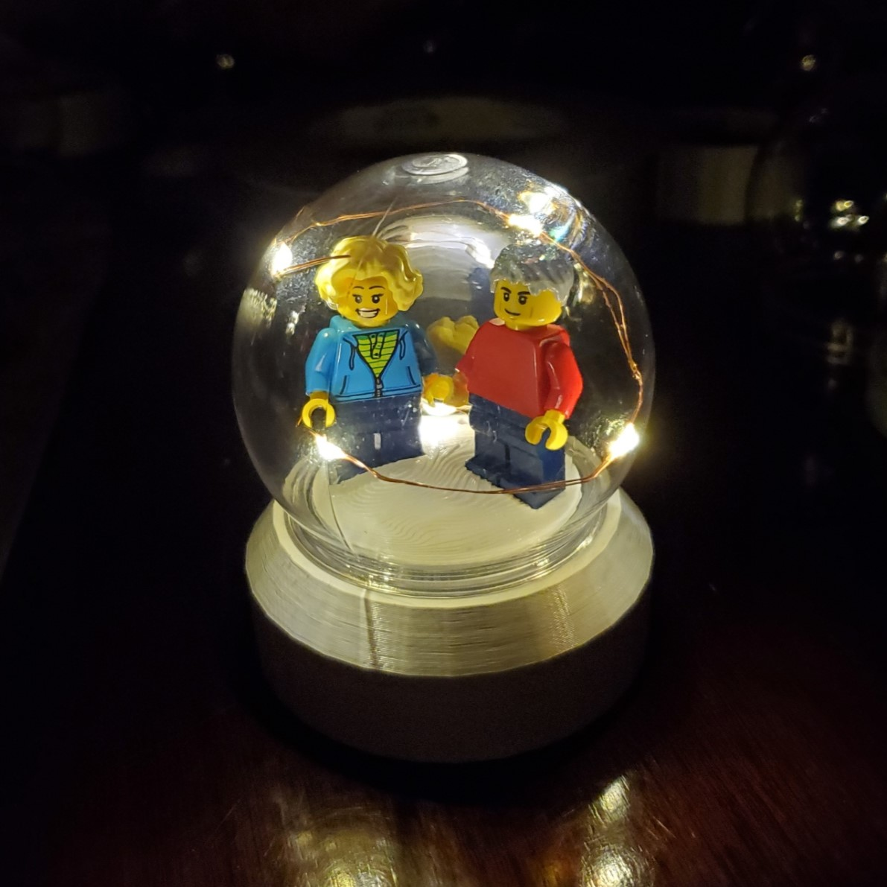
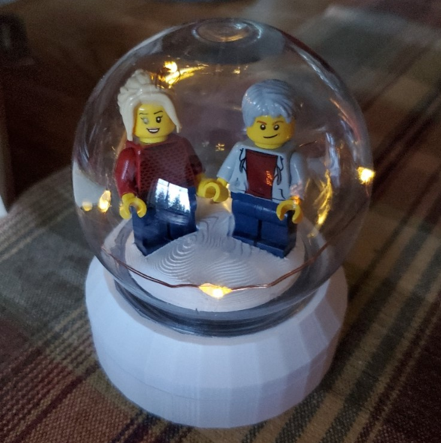

# Christmas Snow Globe 

In this project, I combined my hobbies of PCB and electronics design, 3D modeling, 3D printing, and programming to create personalized snow globes for the holiday season. This README goes through the stages of development for this project and showcases the final build at the end.

## Introduction

I try to create personalized gifts for the holidays, and this year I set out to build something using lights and custom PCBs. After a brainstorming session with my roommate, I decided it would be really neat to incorporate personalized Lego minifigures of everyone. The only way of doing this that came to mind was building a snow globe around them. After plugging my thoughts into the Bing Image Generator and coming up with some concept drawings, I settled on keeping it simple with some timer-controlled LEDs and 3D printed casing. This way I could create a simple yet elegant design, while most importantly, having time to finish it. 

## Features

I initially decided on some key features for the snow globes, and then designed around them. These included:
- Custom Lego minifigures of each person or couple - which I ordered from pick-a-brick
- LED fairy lights to illuminate the minifigures and fit the holiday theme
- A 6-hour ON, 18-hour OFF timer for ease of use
- Battery powered - for ease of use and as a low power consumption challenge

## Design

After ordering the minifigure parts, I also ordered some cheap snow globe tops that would fit. For this I chose 2.7in (69mm) because everything else felt too big. The first part of the design entailed deciding on what batteries and electrical components to use, along with how they would all fit into the snow globe. Next, once I had a general PCB layout and model from Fusion360, I loaded it into Blender and created the snow globe stand parts. Lastly, I designed the fake snow the minifigures would stand on by modeling Lego piece connectors.

### 1. Electronic Design

The first challenge for the electronics design was how to build a precise 6-hour timer. I went through a few concepts such as a crystal oscillator and counter circuit but ultimately settled on using the cheap 8-bit ATtiny85 because it can be programmed with Arduino, is reliable within ~1 minute, and its power-down mode only draws 0.5uA. 

The next challenge was what batteries to use. I wanted them to be easy to find since I wouldn't be the one replacing them every year, but also to last the full month or two the snow globes were used. After considering size requirements and reading through other documentation, I settled on three AAA batteries. This gave me a voltage range of roughly 4.5 - 3.3V over the battery's life, satisfying the 2.6 - 2.7V requirement of the LED fairy lights and providing ample mAh for the expected 0.5 - 3mA draw (depending on the voltage over the LEDs). 

Lastly, I needed to keep the voltage over the LEDs steady for even brightness and low current consumption. During this time, I found a 2.7V linear regulator with very low quiescent current and decided to add a potentiometer in series with the LED fairy lights to allow for adjustable brightness and current consumption post production.

The final stage of the electronics design was to lay everything out on the PCB. To do this I marked out the snow globe dimensions and made sure to put everything in a good location while trying to make sure it was as simple as possible for everyone to access the batteries. The final render of this board can be seen below.

### 2. 3D Design

After I was set on the electronics and confident they would work, I began to create the stand for the snow globe which would also house the PCB and batteries. Because I originally planned on adding some organic detailing to the outside of the stand, I chose to model everything in Blender. I ultimately liked the simple look of the stand itself better, so it probably wasn't necessary, but since I had everything in Blender I decided to also use some of the displacement modifiers to create a snowy scene for the characters to stand on. Below is a render of the final 3D modeled pieces, unfortunately the minifigure textures didn't copy over when I imported them from a past project.

### 3. Programming

The last big challenge of this project, aside from getting everything in time, was to actually program the ATtiny85 to act as a 6-hour timer. This took a while to learn as I had never used interrupts or 8-bit microprocessors before, but ultimately didn't prove to be too difficult. I found configuring the watchdog as an interrupt gave me a pretty steady average of 8.955s per interrupt. This wasn't amazing in terms of accurately measuring 6 hours, but it was the most power efficient way of doing it. And at the end of the day, no one will notice that the timer originally set to turn on at 5:00 p.m. now turns on at 5:04 p.m. a month later.

## Construction

Here I have included some images of the physical construction of each part and the final product.

### Soldered Board

### Stand Top

### Stand Bottom

### Final Product

Update: After almost 2 months the device is still functional. The LED brightness has dimmed a bit, but they still turn on around roughly the same time indicating the timer and power draw calculations were accurate. 

## License

This is just a hobby creation I made as a gift so feel free to do whatever you want with this design if you happened upon it. However, I would recommend reading the considerations below and modifying it or building your own rather than copying it.

## Project Considerations

The following are some things I learned from this project for myself or anyone else to consider when doing something similar.
- I built the stand to screw into the plastic globes which causes the wire connecting the LED strips to the PCB to coil up and sometimes break. In the future, not screwing in the globes or allowing the PCB itself to rotate may be more reliable.
- The Lego pick-a-brick items took about a month and a half to arrive (I got them 3 days before Christmas) 
- There are more accurate and power conservative ways to create a timer, this was just simple and easy to adjust on the fly
- The AAA batteries worked great but they do slip around on the contacts, they should probably have physical dividers between them to hold them in place.