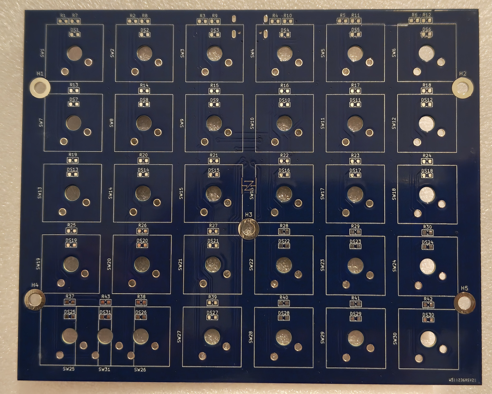

# Greek Keyboard 

This project was built as a request from my brother. His desire was to have a separate keyboard he could use to input Greek letters while writing papers for school. This README goes through an overview of the features, build, and considerations for next time.

## Features

The following were the requested features for this project:
- A separate USB-C keyboard, with a similar feel and look to the Dell XPS-15 (his current laptop)
- Contain all the Greek letters in a small form factor
- If there is extra room add some other common characters (degree symbol, etc.)
- Make it not require Windows language switching

## Design

To meet all these requirements I first came up with a concept for a 5x6 key keyboard, which fit all the Greek letters on the first 4 rows. This left a 5th required row to fit the SHIFT key, and left room for some extra characters. For the extra characters we decided to add the degree symbol along with final sigma, and then add the most common Greek letter accents. For the keyboard keys I decided to go with Cherry MX keys since they were the most readily available and easy to use. The electronics for a keyboard is also relatively straightforward and well documented online. Thus, after some brief research I settled on a 5x6 key matrix to save pin space.  

For the keyboard firmware, and actually sending Windows a Greek character without language switching, I chose to use Unicode inputs. Unicode gives a unique code to every character in the majority of languages. To input a Unicode character you simply have to type in its hexadecimal sequence, followed by ALT + x. This indicated to Windows that the previous input is the hex code for a Unicode character and that they should be converted accordingly. To do this, I internally check for what combination of keys is pressed and then send the corresponding sequence and ALT + x in quick succession. I chose to implement all this through an Arduino Leonardo (ATmega32u4), so I only needed one USB connection for everything.

## Construction

Included below are some images of the final product.

### PCB

### Keyboard Backlights

## License

This is just a hobby creation I made as a gift so feel free to do whatever you want with this design if you happened upon it. However, I would recommend reading the considerations below and modifying it or building your own rather than copying it.

## Project Considerations

The following are some things I learned from this project for myself or anyone else to consider when doing something similar.
- Add an ICSP header and !RESET pin pullup - The ATmega32u4 does not come with a USB bootloader and you first have to program it in. This can be done in many different ways, but I chose to use an Arduino and the built in ArduinoISP.
- It would be easier to solder the Cherry keys in by printing the top of the enclosure first and using it to align them
- The keyboard sounds very different once in the enclosure, consider adding some foam or extra support from the enclosure to minimize the hollow clicking sound.